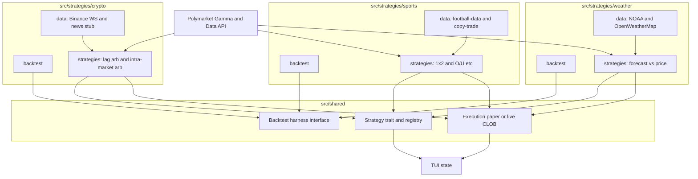

# Polymarket Arbitrage TUI — Implementation Plan

## Stack  

- **Language:** Rust (speed, official Polymarket SDK).
- **TUI:** [Ratatui](https://ratatui.rs) — built-in `Chart` widget for series; [plotters-ratatui-backend](https://docs.rs/plotters-ratatui-backend) if we need heavier plots.
- **Polymarket:** Official [polymarket-client-sdk](https://github.com/Polymarket/rs-clob-client) (crates.io: `polymarket-client-sdk`) with features `clob`, `ws`, `data`, `gamma` — CLOB, Gamma, Data API and WebSocket are all first-party and fast.
- **Config:** `.env` via `dotenvy`; `.env.example` with placeholder names only (no secrets).

## Repo layout

- `src/main.rs` — entry, TUI bootstrap.
- `src/tui/` — Ratatui app, layout, screens (dashboard, crypto, sports, weather, settings/logs).
- `src/pm/` — Polymarket client wrapper (CLOB + Gamma + Data + WS using SDK).
- `src/config/` — load from env and config file.
- `src/shared/` — shared implementation: strategy trait and registry, generic backtest harness interface (e.g. `BacktestRunner` trait), execution module (paper/live, rate limit, position limits), common types used by multiple domains.
- `src/strategies/crypto/` — crypto domain: strategy modules (lag_arb, intra_market_arb, etc.); `data/` (Binance WS, news stub); `backtest/` (crypto-specific backtest using shared harness).
- `src/strategies/sports/` — sports domain: strategy modules; `data/` (football-data.org, copy-trade fetcher); `backtest/` (sports backtest).
- `src/strategies/weather/` — weather domain: strategy modules; `data/` (NOAA, OpenWeatherMap); `backtest/` (weather backtest).
- Tests next to modules or in `tests/` for integration.

## Cursor rules

- **Code owner:** Add `[.cursor/rules/code-owner.mdc](.cursor/rules/code-owner.mdc)`: **You are the code owner.** You are a senior Rust developer. You own the full development lifecycle: implement features, add tests, run and fix lints/tests, and debug so that the codebase is production-ready with no known errors for the user to find. No "TODO" or "fix later" handoffs; resolve or document and track.
- **Polymarket rule:** Update `[.cursor/rules/polymarket-arbitrage.mdc](.cursor/rules/polymarket-arbitrage.mdc)` to state that you are a senior Rust developer as well (so both "Polymarket arbitrage master" and "senior Rust developer" apply).

## Phases

### 1. Foundation

- Cargo workspace or single crate; deps: `ratatui`, `crossterm`, `polymarket-client-sdk` (clob, ws, data, gamma), `tokio`, `dotenvy`, `serde`, `anyhow`, `thiserror`.
- Config: load `.env`; define structs for Polymarket keys, Binance, sports, weather API keys (optional where free tier or no key).
- Polymarket module: init SDK client (CLOB + Gamma + Data); optional WS subscription for orderbook/prices; expose thin wrapper used by strategies and TUI.
- TUI shell: Ratatui app loop, basic layout (top bar, tabbed or sidebar for Crypto / Sports / Weather / Logs), quit and resize handling.
- No trading yet; focus on "connect and show live data" (e.g. one market from Gamma, book from WS).

### 2. Crypto pipeline

- **Data:** Binance WebSocket client (e.g. `kline_5m` / `kline_15m`, `bookTicker`) in `src/strategies/crypto/data/binance.rs`; buffer last N candles and best bid/ask. News stub in `src/strategies/crypto/data/news.rs` (trait + no-op or RSS impl for later paid feed).
- **Strategies (in `src/strategies/crypto/`):** Lag arb (spot vs Polymarket), intra-market arb (YES+NO ≠ 1), optional momentum/mean-reversion stubs. Each implements the shared strategy trait (`signal()` + `metadata()`).
- **Testing:** Per-strategy process: (1) **Backtest** — crypto backtest in `src/strategies/crypto/backtest/` using shared harness from `src/shared/`; (2) **Paper** — live prices, simulated fills; (3) **Live** — gated by config.
- **TUI:** Crypto tab: table of 5/15 min markets (from Gamma), Binance vs Polymarket price, last signal per strategy; optional sparkline/Chart for spot vs market price.

### 3. Sports pipeline

- **Data:** football-data.org client (free tier) in `src/strategies/sports/data/` — fixtures, results, standings; optional TheSportsDB or API-Football later. Copy-trade: Data API client in same `data/` (fetch trades by user, map to markets via Gamma, P&amp;L by market type); store in memory or SQLite for TUI. No scrapers repo in this repo initially; optional scraper adapter later.
- **Strategies (in `src/strategies/sports/`):** Low-odds accumulation, home fortress, O/U by league, 1x2, upset detection, first-to-score (if data exists). Each uses sports data + Polymarket prices; outputs signal (market, side, confidence).
- **Testing:** Backtest in `src/strategies/sports/backtest/` (historical fixtures + Polymarket snapshots, resolution where available) → paper → live.
- **TUI:** Sports tab: fixtures, Polymarket odds, strategy signals; copy-trader panel (selected address, recent trades, simple P&amp;L).

### 4. Weather pipeline

- **Data:** NOAA (GFS or public APIs) + OpenWeatherMap client in `src/strategies/weather/data/`; fetch forecasts for cities that have Polymarket temperature markets.
- **Strategy (in `src/strategies/weather/`):** Algorithm-first: compare forecast probability (e.g. "temp &gt; X") to Polymarket price; signal when spread &gt; threshold. Optional laddering/barbell logic (buy range of outcomes).
- **Testing:** Backtest in `src/strategies/weather/backtest/` (historical forecast vs resolution if we store snapshots); paper then live.
- **TUI:** Weather tab: city markets, forecast vs market price, signals.

### 5. Execution and safety

- **Order placement:** Only via Polymarket SDK (CLOB); execution module in `src/shared/` (or `src/shared/execution/`) that checks config (paper vs live), logs, and calls SDK. Rate limiting and max position size from config.
- **TUI:** Global state for positions, P&amp;L, and log stream; Logs tab shows recent trades and errors.
- **Errors:** All layers use `Result` and propagate; TUI shows errors in Logs and does not panic on network/API failures.

### 6. Cleanup

- Delete [RESEARCH.md](RESEARCH.md) (content is reflected in this plan and the existing [.cursor/rules/polymarket-arbitrage.mdc](.cursor/rules/polymarket-arbitrage.mdc)).
- Update [.cursor/rules/polymarket-arbitrage.mdc](.cursor/rules/polymarket-arbitrage.mdc) to state "Rust + Ratatui + polymarket-client-sdk" as the stack.

## Architecture (high level)

## Deliverables

- Working Rust TUI that connects to Polymarket and shows crypto/sports/weather data and signals.
- Per-strategy backtest + paper path; live gated by config.
- Code-owner rule (including "senior Rust developer") in `.cursor/rules/code-owner.mdc`; polymarket-arbitrage rule updated to state senior Rust developer.
- RESEARCH.md removed; stack and strategy list documented in plan and rules.
